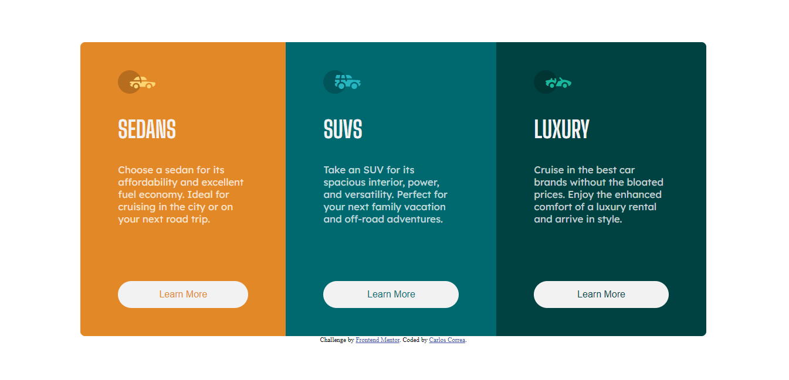
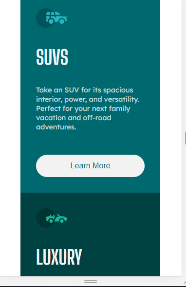

# Frontend Mentor - 3-column preview card component solution

This is a solution to the [3-column preview card component challenge on Frontend Mentor](https://www.frontendmentor.io/challenges/3column-preview-card-component-pH92eAR2-). Frontend Mentor challenges help you improve your coding skills by building realistic projects.

## Table of contents

- [Overview](#overview)
  - [The challenge](#the-challenge)
  - [Screenshot](#screenshot)
  - [Links](#links)
- [My process](#my-process)
  - [Built with](#built-with)
- [Author](#author)

**Note: Delete this note and update the table of contents based on what sections you keep.**

## Overview

### The challenge

Users should be able to:

- View the optimal layout depending on their device's screen size
- See hover states for interactive elements

### Screenshot
- Desktop desing:

- Mobile desing:

### Links

- [Solution URL](https://github.com/Deadflight/3ColumnCardComponent)
- [Live Site URL](https://deadflight.github.io/3ColumnCardComponent/)

## My process

### Built with

- Semantic HTML5 markup
- CSS custom properties
- Flexbox
- Desktop-first workflow
## Author

- Website - [Deadflight](https://github.com/Deadflight)
- Frontend Mentor - [Deadflight](https://www.frontendmentor.io/profile/Deadflight)
- Twitter - [@Deadfligth](https://twitter.com/Deadfligth)